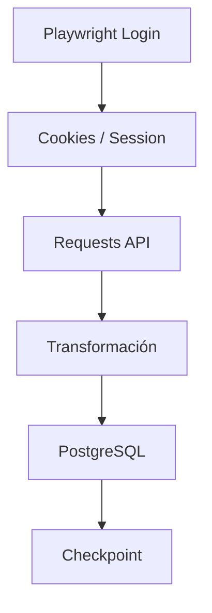

# 🍩 Plataforma de datos El Moro

> Plataforma de datos y pipeline ETL para extracción automatizada de datos desde **POS Zetus (El moro)** hacia **PostgreSQL**, utilizando autenticación vía navegador y consumo de endpoints privados.

---

## 🚀 Overview

Este proyecto permite:

* 🔐 Autenticarse automáticamente en la plataforma Elmoro
* 📡 Consumir endpoints internos protegidos
* 🔄 Transformar datos dinámicos
* 💾 Persistir información en PostgreSQL
* 🧾 Controlar ejecuciones con checkpoints

---

## 🏗️ Arquitectura

Pipeline ETL que integra datos de Elmoro (EOS Zetus) y Google Forms (merma) mediante autenticación automatizada y consumo de APIs.
Los datos se limpian, transforman y almacenan en PostgreSQL como fuente única de verdad.
Finalmente, se visualizan en Metabase (Docker) para análisis y toma de decisiones.


## Flujo E2E de la plataforma de datos



---

## 📁 Estructura del Proyecto

```bash
.
├── main.py                  # Entry point
├── etl.py                   # Gestión de sesión
├── auth_playwright.py       # Login automatizado
├── api_requests.py          # Consumo API
├── fetch_with_playwright.py # Alternativa HTTP via Playwright
│
├── endpoints.py             # Configuración de endpoints
├── param_builders.py        # Generación de payloads
├── date_ranges.py           # Manejo de fechas
│
├── db.py                    # Persistencia (PostgreSQL)
├── preview.py               # Debug / validación de datos
│
├── config.py                # Configuración (⚠️ sensible)
└── playwright_state.json    # Sesión (⚠️ sensible)
```

---

## 🔐 Autenticación

El sistema usa **Playwright** para simular login real y obtener cookies de sesión.

* Detecta dinámicamente inputs de login
* Soporta múltiples layouts de formulario
* Guarda sesión reutilizable

📌 Resultado:

```json
playwright_state.json
```

---

## 🍪 Gestión de sesión

El flujo es resiliente:

1. Intenta usar cookies existentes
2. Si fallan → relogin automático
3. Reconstruye sesión `requests`

✔ Transparente para el usuario

---

## 📡 Consumo de datos

Se utilizan requests autenticados:

* Headers tipo navegador
* Cookies persistentes
* Autenticación básica adicional

📌 Soporta múltiples formatos de respuesta (`MSG`):

* Lista
* Diccionario por sucursal

---

## 🧠 Generación de payloads

Los parámetros se construyen dinámicamente:

* Multi-sucursal
* Rangos de fechas
* Filtros por tipo

Ejemplo:

```python
build_tabla_cuentas_payload_for_day(fecha)
```

---

## 📅 Manejo de fechas

Modos soportados:

| Modo       | Descripción         |
| ---------- | ------------------- |
| `daily`    | Día anterior        |
| `weekly`   | Últimos 7 días      |
| `biweekly` | Últimos 15 días     |
| `monthly`  | Mes actual          |
| `custom`   | Rango manual        |
| `catalogs` | Catálogos completos |

---

## 🔄 Pipeline ETL

### 1. Extract

* Requests autenticados
* Iteración por fechas

### 2. Transform

* Limpieza de valores inválidos
* Normalización de columnas

### 3. Load

* Inserción en PostgreSQL
* Upsert automático
* Refresh de catálogos

---

## 💾 Persistencia

Soporta múltiples estrategias:

| Modo              | Descripción         |
| ----------------- | ------------------- |
| `append_upsert`   | Inserta o actualiza |
| `catalog_refresh` | Borra y recarga     |
| `insert`          | Inserción simple    |

---

## 🧾 Control de ejecución (Checkpoint)

Se registra cada ejecución:

* `RUNNING`
* `SUCCESS`
* `FAILED`

✔ Evita reprocesos
✔ Permite auditoría
✔ Mejora confiabilidad

---

## 📊 Endpoints

### 🔹 Transaccionales

* Consumos

### 🔹 Catálogos

* Categorías
* Artículos
* Unidades de medida

---

## ▶️ Ejecución

### 🔹 Básico

```bash
python main.py --mode daily
```

### 🔹 Custom

```bash
python main.py \
  --mode custom \
  --fecha-inicio 2024/01/01 \
  --fecha-fin 2024/01/31
```

### 🔹 Catálogos

```bash
python main.py --mode catalogs
```

---

## 🧪 Debug y validación

Herramientas incluidas:

* Preview de DataFrame
* Tipos de datos
* Nulos
* Estructura

---

## ⚙️ Configuración

Archivo:

```
config.py
```

Incluye:

* URLs
* Credenciales API
* Configuración DB

---

## ⚠️ Seguridad

**NO subir al repositorio:**

* `config.py`
* `playwright_state.json`
* Credenciales
* Cookies

✔ Usa `.gitignore` correctamente

---

## 🧩 Flujo completo

```text
Login → Cookies → Session → API → Transform → DB → Checkpoint
```

---

## 📈 Roadmap

* [ ] Variables de entorno (`.env`)
* [ ] Logging estructurado
* [ ] Docker
* [ ] Tests automáticos
* [ ] Orquestación (Airflow / Prefect)

---

## 🧑‍💻 Autor

**Néstor Zavaleta**
Data / Automation

---

## ⭐ Notas

Este proyecto combina:

* Web scraping autenticado
* Reverse engineering de endpoints
* ETL incremental

Diseñado para escenarios donde no existe API pública oficial.

---

# ▶️ Cómo ejecutar el proyecto (Step by Step)

## 🧩 1. Clonar el repositorio

```bash
git clone https://github.com/tu-usuario/elmoro.git
cd elmoro
```

---

## 🐍 2. Crear entorno virtual

```bash
python -m venv .venv
```

### Activar entorno

**Windows (PowerShell):**

```bash
.venv\Scripts\activate
```

**Mac/Linux:**

```bash
source .venv/bin/activate
```

---

## 📦 3. Instalar dependencias

Si tienes `requirements.txt`:

```bash
pip install -r requirements.txt
```

Si no, mínimo necesitas:

```bash
pip install requests psycopg2-binary playwright pandas
playwright install
```

---

## ⚙️ 4. Configurar credenciales

Editar archivo:

```bash
config.py
```

Configurar:

* Usuario y contraseña del sistema Elmoro
* Conexión a PostgreSQL

Ejemplo:

```python
API_USER = "TU_USUARIO"
API_PASSWORD = "TU_PASSWORD"

PG_CONFIG = {
    "host": "localhost",
    "dbname": "elmoro",
    "user": "postgres",
    "password": "tu_password",
}
```

---

## 🗄️ 5. Preparar base de datos

Asegúrate de tener PostgreSQL corriendo y crear la base:

```sql
CREATE DATABASE elmoro;
```

Ejecutar tu script:

```bash
SQL/001_schema_consumos.sql
```

---

## 🔐 6. Generar sesión (LOGIN)

Este paso es clave (solo la primera vez o cuando expire sesión):

```bash
ejecutar run_auth_playwright.bat
```

```bash
python auth_playwright.py
```

👉 Esto va a:

* Abrir navegador
* Hacer login automático
* Guardar cookies en:

```bash
playwright_state.json
```

---

## 🚀 7. Ejecutar el ETL

### 🔹 Opción 1: Diario

```bash
python main.py --mode daily
```

---

### 🔹 Opción 2: Semanal

```bash
python main.py --mode weekly
```

---

### 🔹 Opción 3: Mensual

```bash
python main.py --mode monthly
```

---

### 🔹 Opción 4: Rango personalizado

```bash
python main.py \
  --mode custom \
  --fecha-inicio 2024/01/01 \
  --fecha-fin 2024/01/10
```

---

### 🔹 Opción 5: Catálogos

```bash
python main.py --mode catalogs
```

---

## 📊 8. Verificar ejecución

Durante ejecución verás logs como:

```bash
STATUS: 200
CONTENT-TYPE: application/json
```

Y en base de datos:

```sql
SELECT * FROM consumos;
```

---

## 🧠 9. Qué pasa internamente

```text
1. Carga cookies (o hace login)
2. Construye sesión HTTP
3. Itera fechas
4. Llama endpoints
5. Normaliza datos
6. Inserta en PostgreSQL
7. Guarda checkpoint
```

---

## ⚠️ Problemas comunes

### ❌ Error: "No existe playwright_state.json"

👉 Solución:

```bash
python auth_playwright.py
```

---

### ❌ Error de login

* Verifica usuario/contraseña en `config.py`
* Revisa si cambió el HTML del login

---

### ❌ Error DB

* Verifica PostgreSQL corriendo
* Credenciales correctas
* Tablas creadas

---

### ❌ Sesión expirada

👉 Simple:

```bash
python auth_playwright.py
```

---

## ⚡ Automatización

Puedes usar los `.bat` que ya tienes:

```bash
run_daily_minus_1.bat
run_weekly.bat
run_monthly.bat
```

O programarlo con:

* Task Scheduler (Windows)
* Cron (Linux)

---

## ✅ Checklist rápido

* [ ] Entorno virtual activo
* [ ] Dependencias instaladas
* [ ] DB creada
* [ ] Configuración correcta
* [ ] Sesión generada
* [ ] Script ejecutado

---

## 🧑‍💻 Tip PRO

Primera ejecución:

```bash
python auth_playwright.py
python main.py --mode daily
```

Después ya puedes correr directo:

```bash
python main.py --mode daily
```

---

